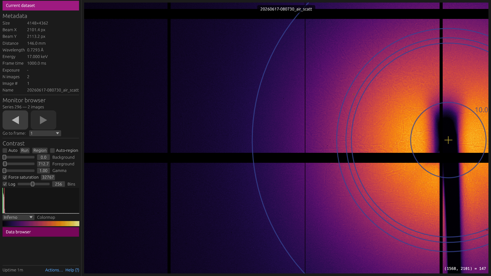
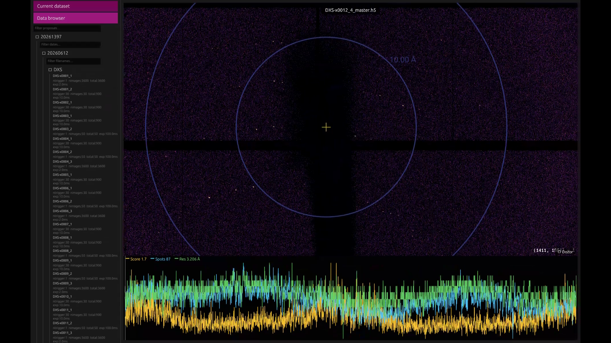
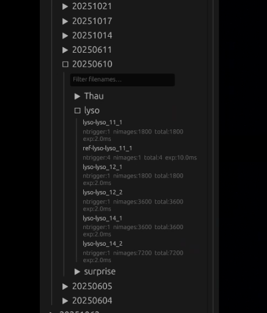

# Pumpkin — X-ray Diffraction Viewer

A desktop application for viewing X-ray diffraction images from DECTRIS EIGER detectors, built with Rust and egui.





## Features

- **Live monitoring** — polls a DECTRIS DCU (Data Collection Unit) via the SIMPLON API and displays frames as they arrive
- **File browser** — open HDF5 (NXmx master files) and TIFF images from disk; scrub through frames in a series
- **Data browser** — hierarchical beamline archive browser with configurable folder layouts; discovers proposals via OS group membership
- **Viewport** — zoom/pan with mouse, fit-to-view, export the current frame as PNG
- **Contrast controls** — auto and manual min/max, gamma correction, multiple colormaps (Inferno, Standard, Grayscale, Rocket, Heat), log-scale histogram
- **Overlays** — configurable resolution rings (d-spacing in Å) and beam-center crosshair drawn on the image
- **Dozor integration** — display per-frame quality scores (Dozor score, spot count, visible resolution) loaded from a JSON file
- **Remote control** — TCP socket (default port 8100) and optional commands file for external tools to push `{"file": ..., "frame": ...}` commands
- **Idle pause** — automatically slows or pauses monitor polling when the window is idle to avoid hammering the detector

## Requirements

- Linux (X11 or Wayland)
- Rust stable toolchain
- System packages: `libxkbcommon`, `gtk3`, `zlib`, Vulkan loader (`vulkan-loader` + `mesa-vulkan-drivers` for software fallback)
- HDF5 bitshuffle plugin (`libH5Zbshuf.so`) if reading DECTRIS EIGER files with bitshuffle compression

## Building

```bash
cargo build --release
```

### Rocky Linux 8 / RHEL 8 binary

A Docker-based build produces a binary compatible with glibc 2.28:

```bash
scripts/build-rocky8.sh          # output: builds/pumpkin-rocky8
scripts/build-rocky8.sh --no-cache
```

Runtime dependencies on the target host:

```bash
dnf install -y epel-release
dnf install -y hdf5 libxkbcommon gtk3
dnf install -y vulkan-loader
dnf install -y mesa-vulkan-drivers   # software Vulkan fallback (no GPU)
```

## Usage

```
pumpkin [OPTIONS]

Options:
  --dcu-url <URL>          Base URL of the DCU (e.g. http://192.168.1.100)
  --poll-period-ms <MS>    Monitor poll interval in milliseconds
  --config <PATH>          Path to a TOML config file
```

When `--dcu-url` is given on the command line, pumpkin connects automatically on startup.

## Configuration

Pumpkin reads `~/.config/pumpkin/config.toml` by default (or the path given by `--config`). All fields are optional.

```toml
dcu_url                        = "http://192.168.1.100"
poll_period_ms                 = 500      # focused-window poll rate
unfocused_poll_period_ms       = 2000     # poll rate when window is not focused
monitor_pause_ms               = 2000     # pause live updates for N ms after zoom/pan
pause_if_idle_after            = 600      # pause monitoring after N seconds idle (0 = never)
auto_connect                   = true     # connect to DCU automatically on startup
ui_scale                       = 1.0      # pixels-per-point; increase for HiDPI
remote_port                    = 8100     # TCP remote-control port
commands_file                  = "/tmp/pumpkin-command.txt"
commands_file_enabled          = true
commands_file_poll_interval_ms = 500
hdf5_plugin_path               = "/usr/lib64/hdf5/plugins"  # override bitshuffle search
splash_folder                  = "/path/to/splash-images"   # random PNG shown when idle

[contrast]
colormap = "Inferno"   # Standard | Grayscale | Inferno | Rocket | Heat

[resolution_rings]
enabled      = true
color        = [0, 200, 255, 200]   # [R, G, B, A]  0–255
stroke_width = 1.0
font_scale   = 1.0

[beam_center]
enabled      = true
color        = [0, 200, 255, 200]
stroke_width = 1.5

# Override the default ring set (d-spacing in Å):
[[rings]]
resolution = 3.897
label = "ice 3.9"

[[rings]]
resolution = 3.669
```

## Data Browser

The side panel includes a hierarchical file browser for navigating beamline proposal archives. It discovers proposals by running `id -nG` and matching OS group names, then lazily loads the directory tree as the user expands nodes.

The browser layout is fully configurable via `[data_browser]` in `config.toml`. If the section is omitted, it defaults to the BioMAX layout at MAX IV.

### How it works

Each proposal maps to a directory under `base_path`. Below proposals, the browser traverses the levels you define — each level lists subdirectories of its parent, optionally descending into a fixed intermediate subdirectory first (`subdir`). At the leaf of the last level, it searches for dataset master files matching `file_suffix`.

### Configuration

```toml
[data_browser.proposal_source]
base_path          = "/data/visitors/biomax"
# OS group suffix used to identify proposals: "20240001-group" → proposal "20240001"
group_suffix       = "-group"
# Required digit count for the proposal ID (0 = no constraint)
proposal_id_digits = 8

# One [[data_browser.levels]] block per directory level between proposals and datasets.
# Omit all levels to browse datasets directly under each proposal directory.

[[data_browser.levels]]
label        = "dates"    # shown in the filter bar hint
date_only    = true       # hide directories whose names are not YYYYMMDD
date_dir_len = 8
sort_desc    = true       # show most recent dates first

[[data_browser.levels]]
label  = "samples"
subdir = "raw"            # descend into visit/raw/ before listing sample directories

[data_browser.datasets]
file_suffix  = "_master.h5"   # filename suffix that identifies dataset master files
search_depth = 2              # how many subdirectory levels to search for master files
```

The example above produces this layout:
```
/data/visitors/biomax/
└── 20240001/           ← proposal (from OS group "20240001-group")
    └── 20240315/       ← date level (date_only = true)
        └── raw/        ← fixed subdir from levels[1].subdir
            └── lyso/   ← sample level
                └── lyso_1_master.h5
```

### Examples

**Flat layout — proposal → sample → files (no date level):**
```toml
[data_browser.proposal_source]
base_path          = "/data/xrd"
group_suffix       = "-xrd"
proposal_id_digits = 6

[[data_browser.levels]]
label = "samples"

[data_browser.datasets]
file_suffix  = "_master.h5"
search_depth = 1
```

**Datasets directly under proposals (no intermediate levels):**
```toml
[data_browser.proposal_source]
base_path          = "/mnt/detector/runs"
group_suffix       = "-users"
proposal_id_digits = 0   # accept any non-empty prefix

# No [[data_browser.levels]] entries

[data_browser.datasets]
file_suffix  = "_master.h5"
search_depth = 3
```

## Remote Control

External tools can push a file and frame number to display by sending newline-delimited JSON to the TCP socket:

```bash
echo '{"file": "/data/run1_master.h5", "frame": 42}' | nc localhost 8100
```

The same JSON format is accepted in the commands file configured via `commands_file` in `config.toml`. The file is watched with inotify (Linux) plus polling, so writes on NFS/GPFS-backed paths are handled reliably.

## Deployment

The `pumpkin.sh` launcher is intended for beamline deployments where multiple beamlines share a single binary with per-beamline config files:

```bash
MAX_BEAMLINE=mx1 ./pumpkin.sh
```

It resolves `config-${MAX_BEAMLINE}.toml` relative to the binary and passes it via `--config`.
